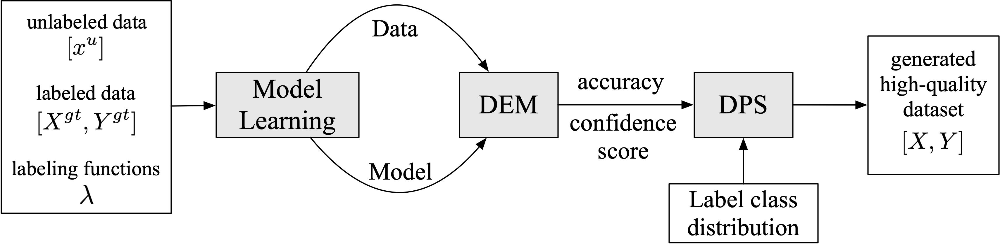

# CPWS

CPWS: Generate High-Quality Data from Confident Programmatic Weak Supervision

**Framework**

**Dependencies**

**Data**

Our project is built based on Python, Pytorch and Wrench. We sincerely thank the efforts from all the researchers!

**Reference**

- [WRENCH: A Comprehensive Benchmark for Weak Supervision](https://arxiv.org/abs/2109.11377) [[code]](https://github.com/JieyuZ2/wrench)
